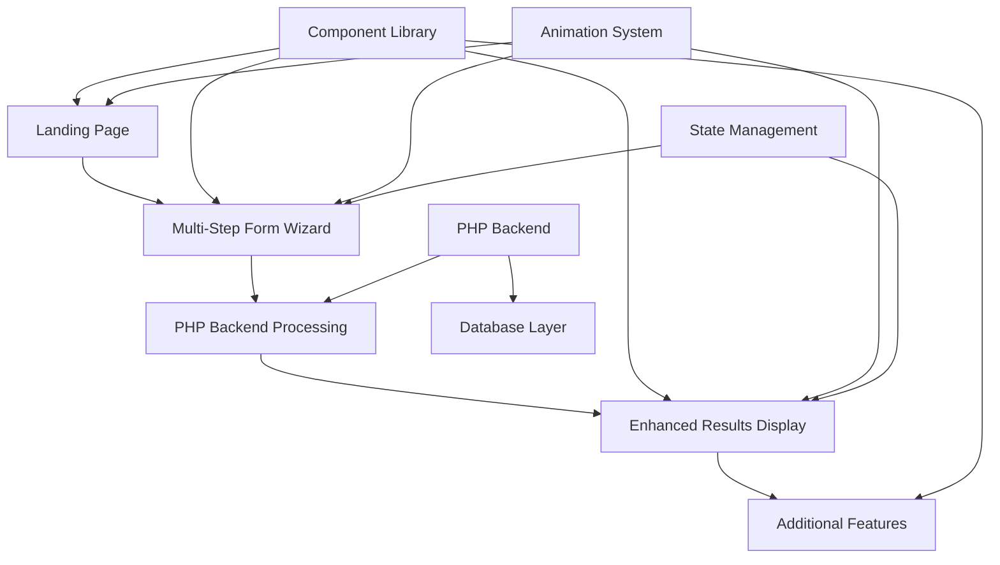

# Design Document

## Overview

The workout site modernization transforms the existing PHP-based workout generator into a cutting-edge web application featuring smooth GSAP animations, modern UI components, and an engaging user experience. The design maintains the core PHP backend functionality while completely reimagining the frontend with a component-based architecture using Shadcn/ui, Mantine, Tailwind CSS, and GSAP for animations.

The modernized application follows a progressive enhancement approach, ensuring the existing PHP workflow remains intact while layering modern interactive elements on top. The design emphasizes performance, accessibility, and visual appeal through a carefully crafted fitness-themed aesthetic with dark mode defaults and vibrant accent colors.

## Architecture

### High-Level Architecture



### Technology Stack Integration

**Frontend Technologies:**
- **GSAP (GreenSock)**: Primary animation engine for smooth transitions, scroll-triggered animations, and micro-interactions
- **Shadcn/ui**: Core component library providing accessible, consistent UI elements
- **Mantine**: Advanced components for complex interactions (date pickers, sliders, modals)
- **Tailwind CSS**: Utility-first styling foundation with custom fitness theme configuration
- **Vanilla JavaScript**: Modern ES6+ for component logic and GSAP integration

**Backend Technologies:**
- **PHP**: Existing workout generation logic (maintained)
- **Session Management**: Current PHP session handling (enhanced)
- **MySQL**: Database integration for future user accounts and progress tracking

### File Structure

```
/
├── assets/
│   ├── css/
│   │   ├── tailwind.css (compiled)
│   │   └── components.css (custom component styles)
│   ├── js/
│   │   ├── components/
│   │   │   ├── LandingPage.js
│   │   │   ├── FormWizard.js
│   │   │   ├── WorkoutDisplay.js
│   │   │   └── AnimationController.js
│   │   ├── utils/
│   │   │   ├── gsap-config.js
│   │   │   └── form-validation.js
│   │   └── main.js
│   └── images/
│       ├── hero/
│       ├── equipment/
│       └── icons/
├── components/
│   ├── ui/ (Shadcn components)
│   └── custom/ (Project-specific components)
├── php/ (existing backend files)
│   ├── index.php (enhanced)
│   ├── generator.php (maintained)
│   ├── workout.php (enhanced)
│   └── api/ (new endpoints)
└── config/
    ├── tailwind.config.js
    └── gsap.config.js
```

## Components and Interfaces

### Landing Page Components

**Hero Section Component**
```javascript
class HeroSection {
  constructor() {
    this.timeline = gsap.timeline();
    this.initAnimations();
  }
  
  initAnimations() {
    // Staggered text reveals
    // Floating equipment icons
    // Parallax background effects
  }
}
```

**Interactive Preview Cards**
- Hover animations with GSAP transforms
- 3D-like perspective effects using CSS transforms
- Smooth transitions between states
- Equipment showcase with animated reveals

**Statistics Section**
- Animated counters using GSAP
- Staggered reveal animations
- Progress bars with elastic easing
- Testimonial carousel with smooth transitions

### Multi-Step Form Wizard

**Form Wizard Controller**
```javascript
class FormWizard {
  constructor() {
    this.currentStep = 1;
    this.totalSteps = 5;
    this.formData = {};
    this.progressTimeline = gsap.timeline();
  }
  
  nextStep() {
    // Validate current step
    // Animate step transition
    // Update progress indicator
  }
  
  updateProgress() {
    // GSAP timeline for progress bar
    // Step completion animations
  }
}
```

**Step Components:**
1. **Personal Info Step**: Animated input focus effects, real-time validation
2. **Goals Step**: Interactive goal cards with selection animations
3. **Experience Step**: Skill level indicators with progress animations
4. **Equipment Step**: Checkbox animations with equipment visualizations
5. **Preferences Step**: Slider components with real-time feedback

**Form Validation System**
- Real-time validation with smooth error animations
- Success state animations
- Progress persistence across steps
- Accessibility-compliant error messaging

### Enhanced Results Display

**Workout Card System**
```javascript
class WorkoutCard {
  constructor(element) {
    this.element = element;
    this.isRevealed = false;
    this.initRevealAnimation();
  }
  
  reveal() {
    // Staggered card reveal animation
    // Exercise counter animations
    // Achievement unlock effects
  }
}
```

**Interactive Elements:**
- Collapsible day sections with accordion animations
- Exercise demonstration placeholders with hover effects
- Progress tracking visualizations
- Achievement badge system with celebration animations

### Animation System Architecture

**GSAP Configuration**
```javascript
// gsap-config.js
export const gsapConfig = {
  defaults: {
    duration: 0.6,
    ease: "power2.out"
  },
  scrollTrigger: {
    start: "top 80%",
    end: "bottom 20%",
    toggleActions: "play none none reverse"
  }
};
```

**Animation Controller**
```javascript
class AnimationController {
  constructor() {
    this.masterTimeline = gsap.timeline();
    this.scrollTriggers = [];
  }
  
  initPageAnimations() {
    // Landing page entrance animations
    // Scroll-triggered reveals
    // Micro-interactions setup
  }
  
  cleanupAnimations() {
    // ScrollTrigger cleanup
    // Timeline disposal
  }
}
```

## Data Models

### Enhanced Form Data Structure

```javascript
const formDataModel = {
  personalInfo: {
    name: String,
    age: Number,
    gender: String
  },
  fitnessGoals: {
    primary: String, // 'muscle_gain', 'weight_loss', 'general_fitness'
    secondary: Array,
    targetAreas: Array
  },
  experience: {
    level: String, // 'beginner', 'intermediate', 'advanced'
    yearsActive: Number,
    previousInjuries: Array
  },
  equipment: {
    available: Array,
    preferred: Array,
    location: String // 'home', 'gym', 'outdoor'
  },
  preferences: {
    workoutDuration: Number,
    daysPerWeek: Number,
    timeOfDay: String,
    intensity: Number // 1-10 scale
  }
};
```

### Workout Plan Enhancement

```javascript
const enhancedWorkoutPlan = {
  metadata: {
    generatedAt: Date,
    userId: String,
    planId: String,
    version: String
  },
  userProfile: formDataModel,
  workoutSchedule: {
    totalWeeks: Number,
    daysPerWeek: Number,
    progressionPlan: Array
  },
  dailyWorkouts: [
    {
      day: String,
      focus: String,
      estimatedDuration: Number,
      exercises: [
        {
          name: String,
          muscleGroup: String,
          equipment: String,
          sets: Number,
          reps: String,
          restTime: Number,
          instructions: String,
          videoUrl: String,
          difficulty: String
        }
      ]
    }
  ],
  achievements: Array,
  progressTracking: {
    completedWorkouts: Number,
    streakDays: Number,
    totalExercises: Number
  }
};
```

## Error Handling

### Frontend Error Management

**Form Validation Errors**
```javascript
class ValidationError {
  constructor(field, message, type) {
    this.field = field;
    this.message = message;
    this.type = type; // 'required', 'format', 'range'
  }
  
  display() {
    // Smooth error animation
    // Accessibility announcements
    // Visual feedback
  }
  
  clear() {
    // Error removal animation
    // State cleanup
  }
}
```

**Animation Error Handling**
- Graceful degradation for unsupported browsers
- Performance monitoring for animation frame drops
- Fallback static states for critical functionality
- Error boundaries for component failures

**Network Error Management**
- Loading state animations during form submission
- Retry mechanisms with visual feedback
- Offline state detection and messaging
- Progressive enhancement for core functionality

### Backend Error Integration

**PHP Error Enhancement**
- JSON error responses for AJAX requests
- Structured error codes for frontend handling
- Validation error mapping to form fields
- Session state recovery mechanisms

## Testing Strategy

### Animation Testing

**Performance Testing**
- 60fps animation validation across devices
- Memory usage monitoring during complex animations
- Battery impact assessment on mobile devices
- Frame rate degradation detection

**Visual Regression Testing**
- Screenshot comparison for animation states
- Cross-browser animation consistency
- Responsive design animation behavior
- Accessibility compliance in animated states

### Component Testing

**Unit Testing**
```javascript
// Example test structure
describe('FormWizard', () => {
  test('should advance to next step with valid data', () => {
    // Test step progression
    // Validate animation triggers
    // Check data persistence
  });
  
  test('should display validation errors with animation', () => {
    // Test error state animations
    // Validate accessibility announcements
    // Check error clearing behavior
  });
});
```

**Integration Testing**
- Form submission flow with animations
- PHP backend integration with enhanced frontend
- Session management across animated transitions
- Database interaction with progress tracking

### Accessibility Testing

**Automated Testing**
- ARIA label validation
- Keyboard navigation flow
- Screen reader compatibility
- Color contrast compliance

**Manual Testing**
- Reduced motion preference respect
- High contrast mode support
- Voice control compatibility
- Touch accessibility on mobile devices

### Performance Benchmarks

**Loading Performance**
- Initial page load under 3 seconds
- GSAP library lazy loading
- Image optimization and responsive loading
- CSS and JavaScript minification

**Runtime Performance**
- Smooth 60fps animations
- Memory usage optimization
- Battery efficiency on mobile
- Graceful degradation strategies

## Design System Implementation

### Color Palette Configuration

```css
/* Tailwind CSS custom theme */
module.exports = {
  theme: {
    extend: {
      colors: {
        primary: {
          blue: '#00D4FF',
          green: '#39FF7A',
          orange: '#FF6B35'
        },
        background: {
          main: '#0B1426',
          card: '#1A2332',
          text: '#2D3748'
        },
        text: {
          primary: '#FFFFFF',
          secondary: '#E2E8F0',
          muted: '#A0AEC0'
        }
      },
      gradients: {
        'blue-green': 'linear-gradient(135deg, #00D4FF 0%, #39FF7A 100%)',
        'orange-pink': 'linear-gradient(135deg, #FF6B35 0%, #F093FB 100%)'
      }
    }
  }
}
```

### Component Styling Standards

**Glassmorphism Effects**
```css
.glass-card {
  background: rgba(26, 35, 50, 0.8);
  backdrop-filter: blur(10px);
  border: 1px solid rgba(255, 255, 255, 0.1);
  border-radius: 16px;
}
```

**Animation Standards**
- Transition duration: 300-500ms
- Easing curves: power2.out, elastic.out
- Hover effects: scale(1.05), translateY(-5px)
- Loading states: pulse, shimmer effects

This design provides a comprehensive foundation for transforming the workout generator into a modern, engaging web application while maintaining the existing PHP functionality and ensuring excellent performance and accessibility.